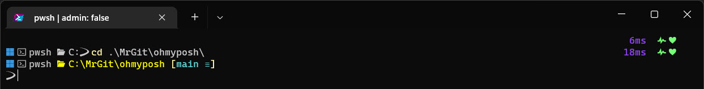

# Configure Oh My Posh for use with PowerShell in Windows Terminal

The following instructions walk you through the process of configuring
[Oh My Posh](https://ohmyposh.dev/) with a one line prompt that automatically changes to a two line
prompt when in a Git repo.



## Prerequisites

- [Windows Terminal](https://docs.microsoft.com/windows/terminal/install)
- [PowerShell 7](https://docs.microsoft.com/powershell/scripting/install/installing-powershell-on-windows)
- [posh-git PowerShell module](https://www.powershellgallery.com/packages/posh-git/)

PowerShell 7 is not required, although it is recommended.

## Installation and configuration

Install Oh My Posh:

```powershell
winget install oh-my-posh
```

Install the CaskaydiaCove (CascadiaCode) nerd font:

```powershell
oh-my-posh font install
```

Configure Windows Terminal to use the CaskaydiaCove font:

```json
"font":
{
    "face": "CaskaydiaCove Nerd Font"
}
```

Add the following to your PowerShell profile. The referenced theme can be found in the themes folder
of this repo.

```powershell
oh-my-posh init pwsh --config "$env:POSH_THEMES_PATH\mikefrobbins.omp.yaml" | Invoke-Expression
$env:POSH_GIT_ENABLED = $true
```

## Disclaimer

All data and information provided in this GitHub repository is for informational purposes only. The
author is not affiliated with Oh My Posh and makes no representations as to accuracy, completeness,
currentness, suitability, or validity of any information in this repo and will not be liable for any
errors, omissions, or delays in this information or any losses, injuries, or damages arising from
its display or use. All information is provided on an as-is basis.
